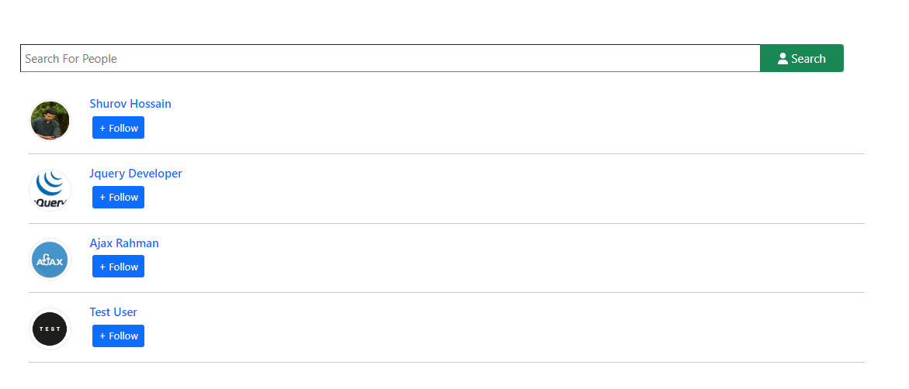
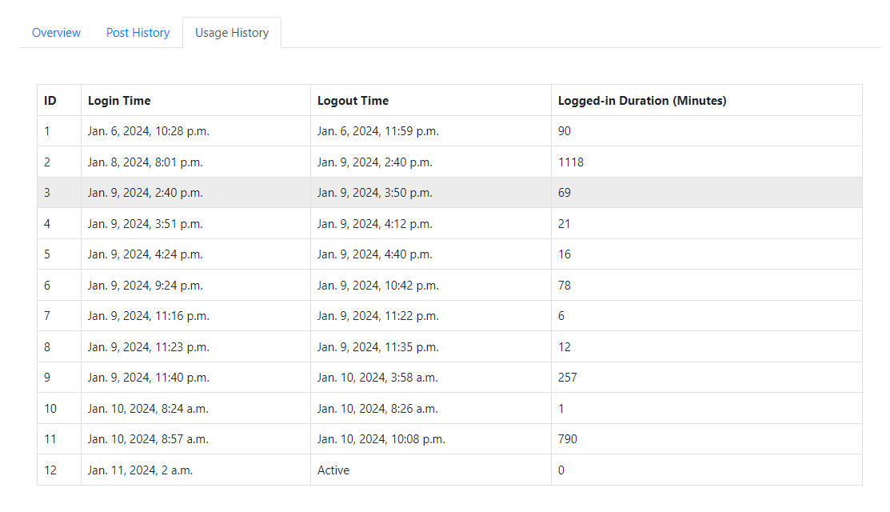
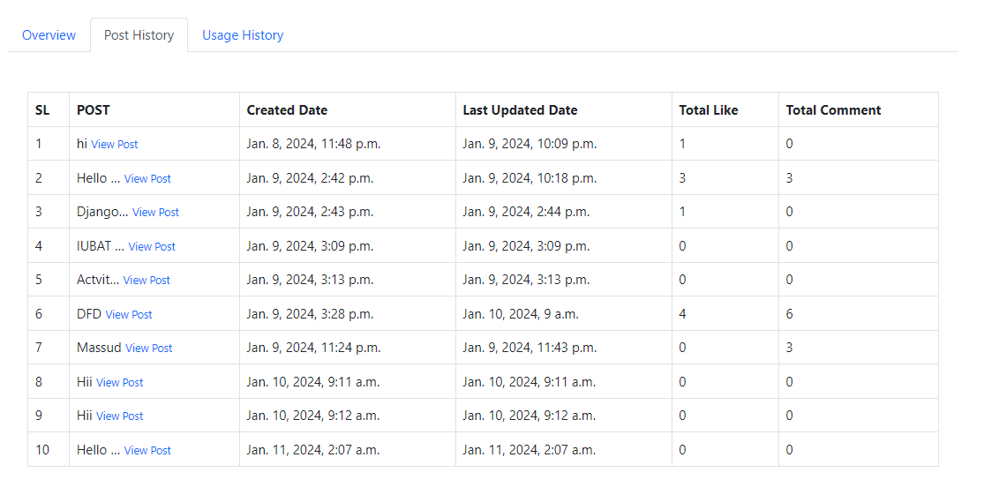

#Soical Media Project With Live Chat and Video Conference System.

**Technology**

Backend: Django MVT, Django-channels, Signals,ZegoCloud

Front-End: HTML-5, CSS-3, Bootstrap, Jquery, Ajax.

Database: Sqlite

**Design Part:**
**--------------**

**DashBoard**

**Chat Page**

**Video Conference**

**Personal profile**

**Other User Profile**

**Post Edit Box**

**Search Panel**

**Comment section**

**Replay Section**

**Bocklist**

**Login History**

**Post History**

**Followers List**

**Following List**

**Post Liked Users List**

**User Requirements**
1. User Authentication & Authorization
2. Profile Management 
3. Connection Management 
4. Blocklist Management 
5. Post Management 
6. Like, Comment & Replay Management 
7. Live Chatting System 
8. Notification System 
9. Video Conference System
10. Account History
11. Delete Account

**System Requirements for all the user requirements**

  1.1 Multiple Users can create accounts using their valid and unique email.
  1.2 Users need to provide their First Name, Last Name, and Username
  1.3 Users must need to verify the email address.
  1.4 Users can log in with the registered credentials details.

  2.1 For each user a dynamic profile will generated with all personal details and post details. 
  2.2 Users can visit others' profiles and also their own profiles.
  2.3	Users can edit, and delete their profile information like First name, last name, bio, address, country, about, profile picture, and other social media profile links. 

  3.1 Users can follow/unfollow other users. 
  3.2 The system will suggest unfollowed users to increase connections 
  3.3 Users can see their own Following & Followers count and list
  3.4 Users can also see others following & followers count and list
  	

  4.1 Users can block/unblock other users. 
  4.2 Users can manage their blocklist, including viewing and removing blocked users.
  4.3 Blocked users cannot view the profile, or posts, and cannot send messages.
  4.4 Users also cannot see the blocked user the profile, or posts, and cannot send messages
  4.5 Blocked user follow following status will be reset. 

  5.1 Users can share their thoughts by posting status including image. 
  5.2 Status will appear on others' home pages and the owner's profile page. 
  5.3 User can like and comment on their posts and also other’s posts. 
  5.4  User can edit, and delete their own post.

  6.1 Users can like, and comment on other's posts. 
  6.2 Users can also like, and comment on their posts. 
  6.3 Users can replay the comment. 
  6.4 Users can also undo the reaction on the post. 
  6.5 Total Likes and comments count will show for each post
  6.6 Users can see the liked users list by clicking on the count.

  7.1 Users can engage in one-on-one chats. 
  7.2 All the registered users will be available on the chatting page except blocked users 
  7.3 Users can see the online/offline status of all users 
  7.4 Message will be sent and received without refreshing the page

  8.1 Users receive notifications for various activities, including messages, likes, and comments. 
  8.2 5 types of notifications are there, Like, comment, replay, follow, and message notification
  8.3 All the notifications are visible on the notification page in detail.
  8.4 There is a button to go to the place from where the notification comes 
  8.5 Unread notifications count will be visible in the notification icon 
  8.6 Users can delete the notification

  9.1 Users can join video conferences with room ID and link. 
  9.2 Users can create new conference meetings and share room IDs or links. 
  9.3 The system supports multi-user video conferences. 
  9.4 User can turn on/off camera and mike. 
  9.5 Users can share screens on conference 
  9.7 Users can see the names and images of all people who joined the meeting. 
  9.8 Users can also chat on the video conference interface that will not save.

**Functional Requirements**

1.	The user needs to verify the mail address, a Verification link will be sent to the email address.
2.	Only email Verified users can log in.
3.	The username must be unique.
4.	One email can allow for one account.
5.	User profile data will be saved and shown to the user profile.
6.	User can edit/delete their own post.
7.	Users can undo like on a post.
8.	Users can unfollow connections.
9.	Users can see the message time.
10.	All the messages will be saved in the database, with the time.
11.	User will get notifications for actions related to their profile.
12.	The user can turn on/off the camera and mike in a video conference.

**Non-Functional Requirements:**
Performance:  
  The system can handle multiple users. 

Security: 
  Secure user authentication and authorization mechanisms to protect user accounts and personal information. 
  Only verified users can log in and see other’s data. 

Data Backup and Recovery: 
  All the data is saved in the database.
